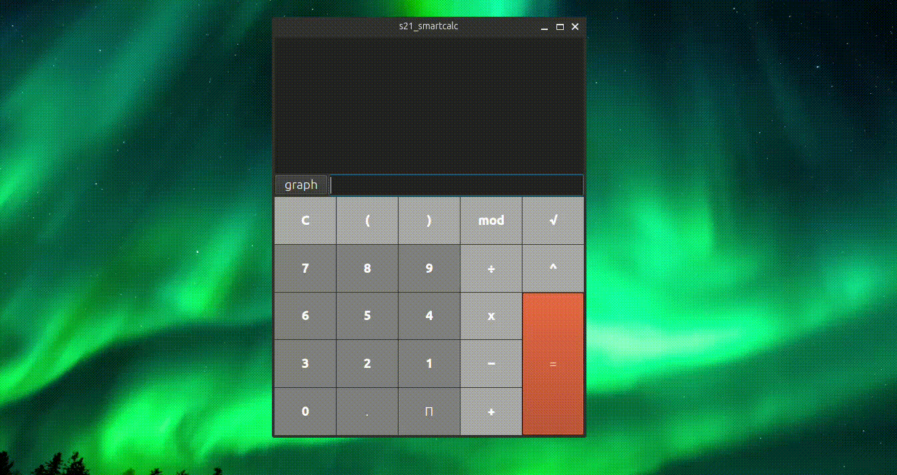
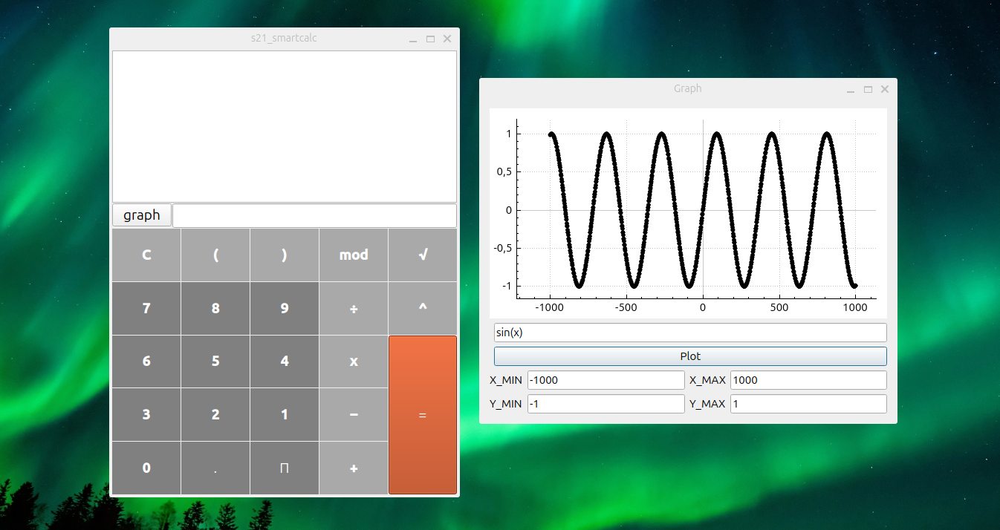

# s21_smartcalc_v2.0
School 21 Calculator poject for educational purposes. Supports trig functions, real mod (works with negative numbers), graphs, autocompletion, detects errors in user input.
Minimalistic design:

